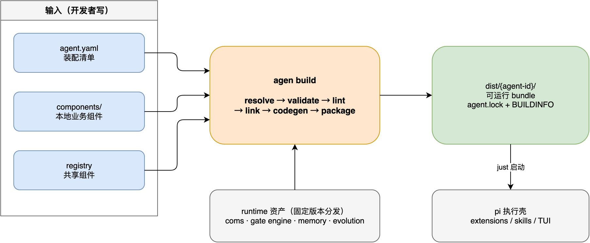

# Loom 🧵

**Weave components into agents. 把组件编织成智能体。**

Loom 是一个声明式智能体构建框架：开发者按规范编写业务组件（tool / bridge / skill / workflow / knowledge / persona / gate / output / review），Loom 编译器把组件与装配清单（`agent.yaml`）编译为**可直接运行的智能体 bundle**。

```bash
loom init my-agent        # 生成装配清单与组件骨架
loom lint && loom build   # 六阶段编译：resolve → validate → lint → link → codegen → package
cd dist/my-agent && just my-agent   # 启动，智能体上线
```



## 为什么是 Loom

写智能体不该是"堆一个越来越长的 prompt"。在对 5 个生产级智能体（跑批值班、数据资产、设计文档、技术专家、量化投研）的逆向分析中，我们发现它们的骨架完全同构——**组件化能力 + 显式工作流 + 数据化边界 + 资产化知识**。Loom 把这套经过生产验证的架构沉淀为规范与工具链：

- 🧩 **组件即一切**：九种组件类型是唯一的能力声明面。业务逻辑永远由你手写，平台只生成装订层
- 🕸️ **组织显式化**：`assembly` 声明组件间的组织关系（分组/路由/人工确认点），编译期校验闭环
- 🔒 **边界硬约束**：红线不止写在 prompt 里——gate 把文件/命令/出网白名单变成运行时强制拦截，每条红线必须有硬约束兜底
- 🧠 **三类资产分层**：knowledge 管"被批准的事实"（candidate → 人工 promote），memory 管"发生过的上下文"（OpenViking），evolution 管"可复用的做法"（经验自动沉淀为组件候选）
- 🛡️ **生成即合规**：统一工具返回契约、bridge JSON envelope、诚实标注（快照/候选/unknown）由编译器内建，不靠开发者自觉
- 🔓 **逃生舱常开**：本地组件可随时覆盖 registry 组件；Loom 约束架构，不约束实现

## 隐喻体系

> 线（threads）= 组件，图样（pattern）= 装配，织机（loom）= 编译器，布（fabric）= 可运行智能体。

## 仓库结构

```
loom/
├── docs/                  # 设计文档
│   ├── AGENT_DSL_SPEC.md  #   规范主文档（v0.3, components-first）
│   ├── COMPILER_DESIGN.md #   编译器设计（6 阶段流水线）
│   ├── README.md          #   文档导航
│   └── analysis/          #   5 份生产智能体逆向分析（设计依据）
├── schema/                # JSON Schema（CI / IDE 校验）
├── templates/             # 组件 / 装配 / 工作流 / 边界 起步模板
├── examples/              # 最小示例 + 复杂示例（通过 schema 校验）
└── diagrams/              # 规范插图（.drawio 源 + 可编辑 PNG）
```

## 文档

- [规范](docs/AGENT_DSL_SPEC.md) · [编译器设计](docs/COMPILER_DESIGN.md) · [组件模板](templates/) · [示例](examples/) · [设计依据：5 份智能体分析](docs/analysis/)
- 运行时基于 [pi coding agent](https://github.com/earendil-works/pi)；记忆后端适配 [OpenViking](https://github.com/volcengine/OpenViking)；经验进化借鉴 [agent-self-evolution](https://github.com/Shiorangerin/agent-self-evolution)

## 状态

当前为**规范与设计阶段**（v0.3）：DSL 规范、JSON Schema、模板、示例、编译器设计已就绪；
编译器实现（`loom validate / lint / build / smoke`）按 [MVP 优先级](docs/README.md#5-当前建议实现优先级)推进中。
