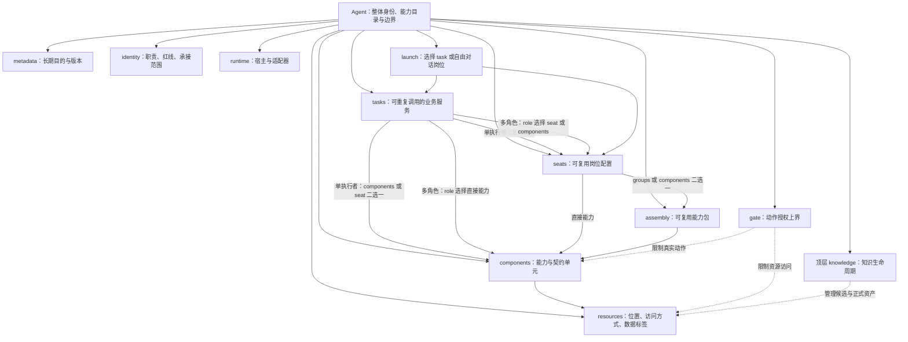

# Loom Agent 整体模型

```mermaid
flowchart TB
  Agent[Agent：整体身份、能力目录与边界]
  Meta[metadata：长期目的与版本]
  Identity[identity：职责、红线、承接范围]
  Runtime[runtime：宿主与适配器]
  Gate[gate：动作授权上界]
  Resources[resources：位置、访问方式、数据标签]
  Components[components：能力与契约单元]
  Tasks[tasks：可重复调用的业务服务]
  Seats[seats：可复用岗位配置]
  Assembly[assembly：可复用能力包]
  Knowledge[顶层 knowledge：知识生命周期]
  Launch[launch：选择 task 或自由对话岗位]

  Agent --> Meta
  Agent --> Identity
  Agent --> Runtime
  Agent --> Resources
  Agent --> Components
  Agent --> Tasks
  Agent --> Seats
  Agent --> Assembly
  Agent --> Gate
  Agent --> Knowledge
  Agent --> Launch

  Tasks -->|单执行者：components 或 seat 二选一| Components
  Tasks -->|单执行者：复用岗位| Seats
  Tasks -->|多角色：role 选择 seat 或 components| Seats
  Tasks -->|多角色：role 选择直接能力| Components
  Seats -->|groups 或 components 二选一| Assembly
  Seats -->|直接能力| Components
  Assembly --> Components
  Components --> Resources

  Gate -.限制真实动作.-> Components
  Gate -.限制资源访问.-> Resources
  Knowledge -.管理候选与正式资产.-> Resources
  Launch --> Tasks
  Launch --> Seats
```

task 定义业务；role 是该业务内的分工；seat 是可跨 task 复用的岗位配置。组件被声明不代表自动暴露，seat/role 的能力选择和 gate 共同决定实际可用范围。
