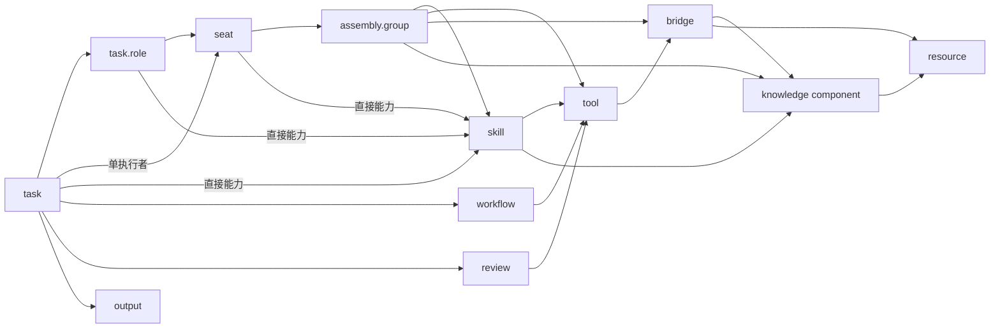
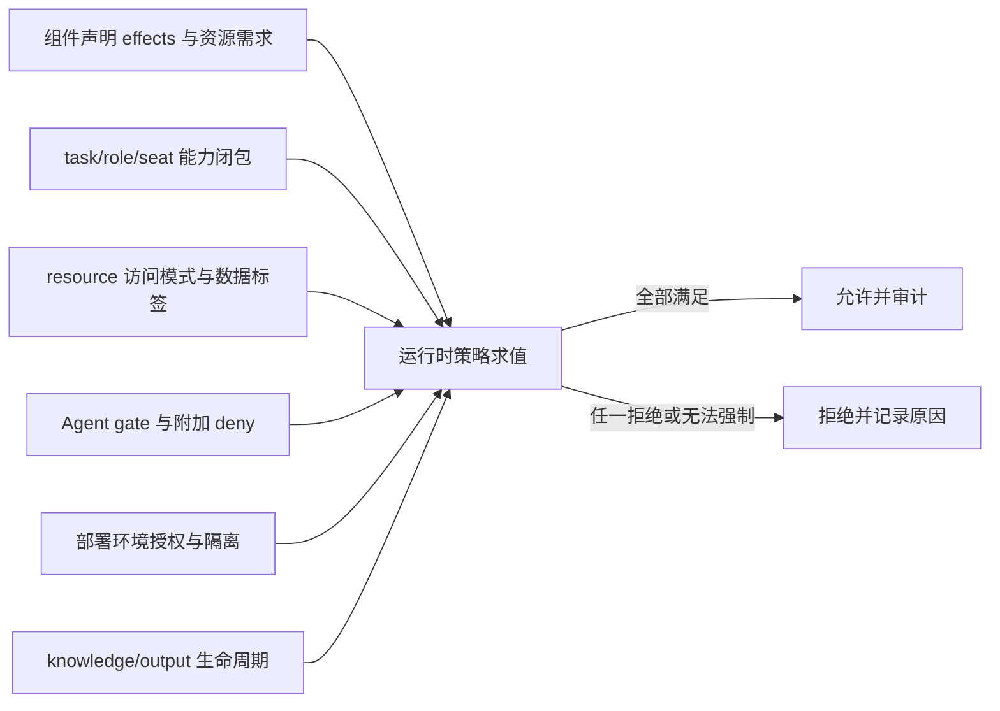

# Loom 静态依赖与策略边界

```mermaid
flowchart LR
  Task[task]
  Role[task.role]
  Seat[seat]
  Group[assembly.group]
  Skill[skill]
  Tool[tool]
  Bridge[bridge]
  Domain[knowledge component]
  Resource[resource]
  Flow[workflow]
  Review[review]
  Output[output]

  Task --> Role
  Task -->|单执行者| Seat
  Task -->|直接能力| Skill
  Task --> Flow
  Task --> Review
  Task --> Output
  Role --> Seat
  Role -->|直接能力| Skill
  Seat --> Group
  Seat -->|直接能力| Skill
  Group --> Skill
  Group --> Tool
  Group --> Bridge
  Group --> Domain
  Skill --> Tool
  Skill --> Domain
  Tool --> Bridge
  Bridge --> Domain
  Bridge --> Resource
  Domain --> Resource
  Flow --> Tool
  Review --> Tool
```

静态引用只允许沿图中方向发生，并且组件 `requires` 图必须无环。workflow 可有显式、有次数上限的业务回边；那是运行控制流，不是静态依赖环。workflow 不引用 seat，tool 不引用 phase，resource、gate、output 不反向引用使用者。

```mermaid
flowchart LR
  Request[组件声明 effects 与资源需求] --> Check[运行时策略求值]
  RoleLimit[task/role/seat 能力闭包] --> Check
  ResourceRule[resource 访问模式与数据标签] --> Check
  Gate[Agent gate 与附加 deny] --> Check
  Environment[部署环境授权与隔离] --> Check
  Lifecycle[knowledge/output 生命周期] --> Check
  Check -->|全部满足| Allow[允许并审计]
  Check -->|任一拒绝或无法强制| Deny[拒绝并记录原因]
```
