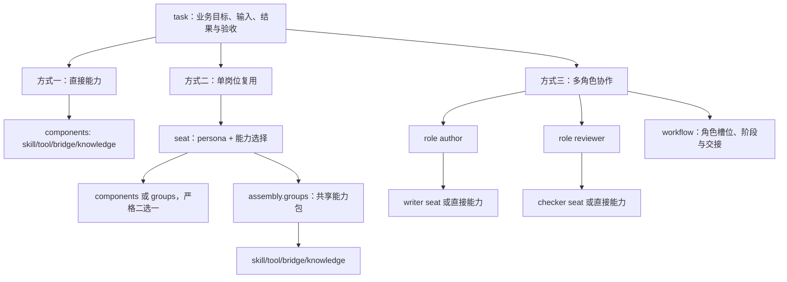

# Loom 能力装配方式

```mermaid
flowchart TB
  Task[task：业务目标、输入、结果与验收]

  Task --> A[方式一：直接能力]
  A --> AC[components: skill/tool/bridge/knowledge]

  Task --> B[方式二：单岗位复用]
  B --> Seat[seat：persona + 能力选择]
  Seat --> SC[components 或 groups，严格二选一]

  Task --> C[方式三：多角色协作]
  C --> Author[role author]
  C --> Reviewer[role reviewer]
  Author --> WriterSeat[writer seat 或直接能力]
  Reviewer --> CheckerSeat[checker seat 或直接能力]
  C --> Workflow[workflow：角色槽位、阶段与交接]

  Groups[assembly.groups：共享能力包]
  Groups --> Shared[skill/tool/bridge/knowledge]
  Seat --> Groups
```

简单 task 不需要 seat 或 assembly。seat 的价值是复用稳定的岗位职责和能力配置；assembly 的价值是复用能力包。二者都不是任务入口、流程调度器或安全沙箱。
