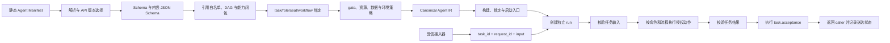

# Loom 从声明到一次运行

```mermaid
flowchart LR
  Manifest[静态 Agent Manifest] --> Parse[解析与 API 版本选择]
  Parse --> Schema[Schema 与内嵌 JSON Schema]
  Schema --> Link[引用白名单、DAG 与能力闭包]
  Link --> Bind[task/role/seat/workflow 绑定]
  Bind --> Policy[gate、资源、数据与环境策略]
  Policy --> IR[Canonical Agent IR]
  IR --> Package[构建、锁定与启动入口]

  Adapter[受信接入器] --> Request[task_id + request_id + input]
  Package --> Start[创建独立 run]
  Request --> Start
  Start --> Input[校验任务输入]
  Input --> Execute[按角色和流程执行授权动作]
  Execute --> Result[校验任务结果]
  Result --> Evaluate[执行 task.acceptance]
  Evaluate --> Deliver[返回 caller 并记录送达状态]
```

Manifest、IR、run record 是不同对象。一次执行完成、质量验收通过、结果送达是三个独立状态；静态校验不替代真实 resolver、sandbox、审批凭证、交付回执或业务运行。
