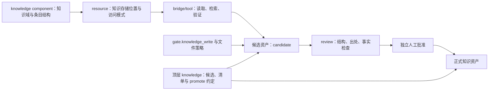

# Loom 知识与候选生命周期

```mermaid
flowchart LR
  Store[resource：知识存储位置与访问模式]
  Domain[knowledge component：知识域与条目结构]
  Read[bridge/tool：读取、检索、验证]
  Candidate[候选资产：candidate]
  Review[review：结构、出处、事实检查]
  Human[独立人工批准]
  Promoted[正式知识资产]
  Gate[gate.knowledge_write 与文件策略]
  Lifecycle[顶层 knowledge：候选、清单与 promote 约定]

  Domain --> Store
  Store --> Read
  Read --> Candidate
  Gate --> Candidate
  Lifecycle --> Candidate
  Candidate --> Review
  Review --> Human
  Human --> Promoted
  Lifecycle --> Promoted
```

资源回答“资料在哪里、如何访问”；知识域组件回答“资料按什么结构理解”；顶层 knowledge 回答“候选如何治理”。candidate 前缀、review 或人审文本都不会自动授予写入和晋级权限，正式 promote 必须在独立人工授权上下文完成。
