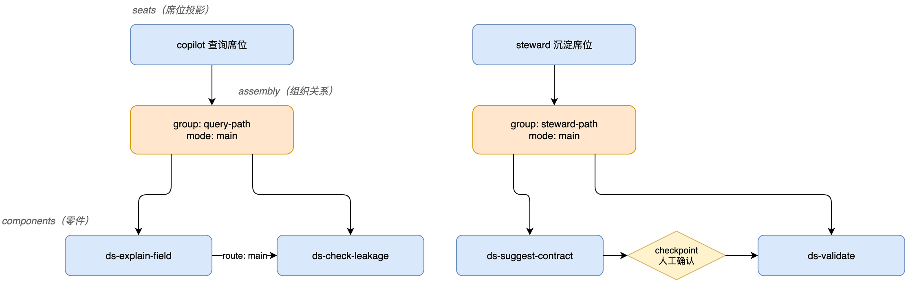
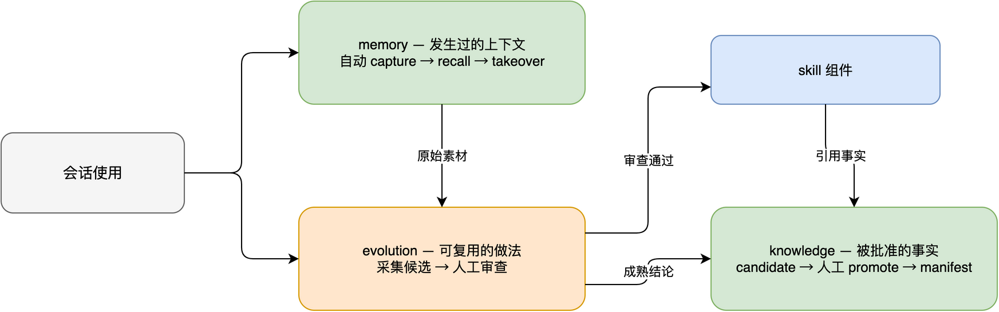
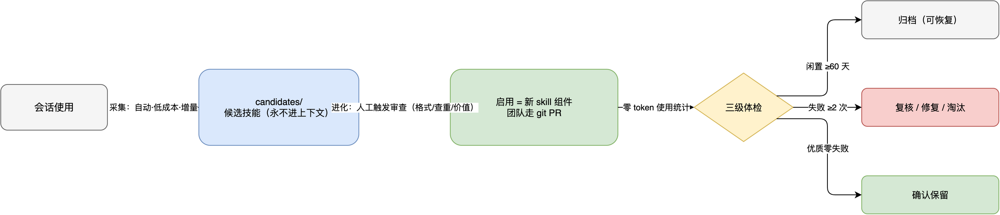
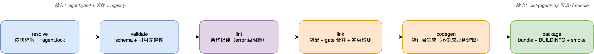

# Agent DSL 规范 v0.3（components-first）

> 基于 5 个生产智能体（batch_duty / data_asset / design_doc / tech_expert / quant-research）
> 的逆向分析提炼的**声明式智能体定义规范**。
>
> 核心判断：**Agent 不是一段 prompt，而是一份装配清单 + 一组业务组件 + 一套边界规则 + 一个工作流图。**
>
> v0.3 定位：**全新设计，无兼容包袱**。`components` 是唯一的能力声明面；
> 少量语法糖由编译器归一为匿名组件，不存在"legacy 投影"。

---

## 1. 从 5 个智能体抽出来的共性

这 5 个项目虽然业务不同，但运行范式高度一致：

| 维度 | 共性结论 |
|---|---|
| 身份 | 都有清晰的角色定义、红线、会诊路由 |
| 工作流 | 都是"阶段化"而不是一次性问答 |
| 事实 | 真正可靠的结论来自确定性 bridge / 查询 / 校验，不靠 LLM 猜 |
| 边界 | 都有硬边界：只读、候选态、workspace、禁止直接晋升或执行业务动作 |
| 资产 | 最终产物不是聊天记录，而是文档、候选知识、报告、草稿、告警单 |
| 可观测 | 阶段进度、产物路径、失败原因都要可见 |

这意味着 DSL 的重点不是"描述一个 prompt"，而是描述：

1. **这个 Agent 是谁**
2. **它由哪些业务组件组成**
3. **组件如何组织、如何串成工作流**
4. **哪些事情绝对不能做**
5. **结果产出到哪里**
6. **哪些部分可以沉淀为可复用资产**

---

## 2. 设计原则

### 2.1 声明业务，编译成运行态

开发者写的是：业务身份、组件接口、组件组织、边界策略、知识生命周期、输出位置。

平台负责把这些声明编译成：`.pi/APPEND_SYSTEM.md`、`.pi/persona/*`、`.pi/skills/*`、
`extensions/*-agent.ts`、`extensions/*-gate.ts`、`tools/*.py`、`justfile`、`dist/<agent>/...`。

### 2.2 事实与判断分离

- **事实**：由 bridge / 查询 / 校验器 / 图谱 / 数据探针给出
- **判断**：由 LLM 组织、解释、路由、归纳
- **硬规则**：由 gate 强制

### 2.3 组件化优先（唯一模型）

不要把所有能力塞进一个大 prompt，也不要给同一件事两种声明方式。
Agent 的全部业务能力只在一个地方声明——`components`：

- tool / bridge / skill / workflow / knowledge / persona / gate / output / review

少量语法糖（如 seat 的内联 persona 文本）由编译器归一为匿名组件。
**规范内部只有一种模型：组件 + 组织 + 策略。**

### 2.4 工作流必须支持循环

投研、值班、知识沉淀这类场景的本质是：看数据 → 形成假设 → 执行检查 → 根据结果回退/继续。

所以工作流组件必须支持：线性流、分支、循环、人工确认点、回退点。

### 2.5 边界要数据化

红线不能只写在自然语言里，必须落成可执行的规则：
可写路径、禁止命令、egress 策略、只读源、candidate 生命周期、人工晋升点。

### 2.6 采集与进化解耦

借鉴 agent-self-evolution 的核心设计哲学：

- **采集是全自动的、安静的、低成本的**——只负责"记下来"，从不打扰工作流；
- **进化是完全人工触发的**——深度审查、启用技能、更新记忆只在人发起时发生；
- **自动生成的内容（技能候选/经验）永不直接生效**——未通过审查前不进上下文、不进组件图。

这条原则把 candidate 生命周期从知识数据推广到**技能与组件自身**：
组件有两个来源——开发者手写 + 使用中生长，两者走同一条审查闸门。

---

## 3. 规范模型

### 3.1 输入与输出

- **规范输入**：一份 `agent.yaml` + 其引用的组件目录。
- **规范输出**：编译器归一化后的内部图——

| 层 | 含义 |
|---|---|
| `metadata` | 身份（机器面） |
| `identity` | 人设与边界声明 |
| `runtime` | 执行壳与适配器 |
| `components` | 业务组件图（唯一能力声明面） |
| `assembly` | 组件组织关系 |
| `seats` | 席位投影 |
| `gate` | Agent 级边界策略 |
| `knowledge` | Agent 级知识生命周期策略 |
| `memory` | 会话记忆后端 |
| `evolution` | 经验自进化闭环 |
| `coms` | 会诊连接 |
| `launch` / `settings` | 启动入口与运行配置 |

### 3.2 归一规则（唯一的一条）

- 一切能力声明归一为组件；
- 语法糖（seat 内联 persona、组件 `inline` 内容）由编译器展开为匿名组件；
- 同一能力重复声明（两个组件 provide 同一个 tool/skill 名）→ **编译期 error**，不静默选边。

### 3.3 模型全景


---

## 4. 顶层结构

```yaml
apiVersion: agent-dsl/v1
kind: Agent

metadata: {}
identity: {}
runtime: {}      # 执行壳与适配器（4.1 / 4.2）
components: []   # 业务组件（§7）——唯一能力声明面
assembly: {}     # 组件组织关系（§8）
seats: []        # 席位投影（§9）
gate: {}         # Agent 级边界策略（§10）
knowledge: {}    # Agent 级知识生命周期策略（§11）
memory: {}       # 会话记忆后端（§12）
evolution: {}    # 经验自进化闭环（§13）
coms: {}         # 会诊网络（§14）
launch: {}       # 启动入口（§15）
settings: {}     # 运行配置（§15）
```

## 4.1 Pi runtime model

Pi 是这套 DSL 的最底层运行壳。DSL 不重新发明 runtime，而是把声明编译成 Pi 已有的扩展点、技能机制和 TUI 能力。

### 映射关系

| DSL 层 | Pi 运行时对应 |
|---|---|
| `identity` | system prompt / `.pi/APPEND_SYSTEM.md` / prompt templates |
| `components[tool]` | `pi.registerTool()` |
| `components[bridge]` | tool 背后的确定性实现 / extension action |
| `components[skill]` | `.pi/skills/*.md` |
| `components[workflow]` | session event + widget + status + loop control |
| `components[persona]` | `.pi/persona/*.md` |
| `assembly` | extension 内的装配逻辑 / 组件依赖关系 |
| `gate` | `tool_call` / `input` / `user_bash` 拦截器 + sandbox |
| `knowledge` | `appendEntry` / candidate 文件 / workspace |
| `launch` | CLI flags、extension 加载、skill 加载、settings.json |
| `settings` | Pi 配置项 |
| `coms` | 扩展通信 / 会话消息传递 |

### 关键事实

- Pi 的扩展机制是最直接的编译目标：`pi.on(...)`、`pi.registerTool(...)`、`pi.registerCommand(...)`、`pi.registerFlag(...)`、`ctx.ui.setWidget(...)`。
- `tool_call` 可以拦截、修改参数、阻断执行，因此它是 gate 的主要落点。
- `session_start` / `session_shutdown` 适合做资源装载与清理。
- `setWidget` / `setStatus` 是 workflow 可观测性的落点。
- Pi 本身不提供内建权限系统，所以 `gate` 必须由 DSL + extension + 运行环境一起实现。

### 这意味着

- DSL 负责"声明"；Pi 负责"执行壳"；编译器负责把 DSL 的声明映射成 Pi 的 extension / skill / prompt / UI / gate 组合。

---

## 4.2 Memory backend —— OpenViking 集成（标准运行时适配层）

> 结论先行：**OpenViking 不是业务组件，不进入 `components`；
> 它是 Agent 的记忆基础设施，作为 `runtime adapter / memory backend` 标准化。**

### 为什么不能放进 components

依据 OpenViking 源码（`examples/pi-coding-agent-extension/`）的三个事实：

1. **它挂的是 Pi runtime hooks，不是业务工具面**：`session_start` / `before_agent_start`（recall 注入）/ `turn_end`（capture）/ `context`（takeover）/ `session_before_compact` / `session_shutdown` / `agent_end` / `tool_call`。业务组件从不触碰这些钩子——这是 runtime 适配器的特征。
2. **它已是可分发的 integration package**：自带 `plugin.json`、`config.json`、`skills/openviking-memory/SKILL.md`、`viking_*` 工具组，安装方式是拷入 `~/.pi/agent/extensions/` 并注册。
3. **它的语义是"会话记忆与在线上下文"，不是"版本化知识资产"**：`viking://` 上下文空间、L0/L1/L2 分层（abstract/overview/content）、自动 recall、takeover 用 archive overview 替换已提交历史。

### 与 knowledge 的分层（互补，不可互相替代）

| 维度 | `knowledge` | `memory`（OpenViking） |
|---|---|---|
| 本质 | 版本化知识资产（Git 管理） | 会话记忆 / 在线上下文 |
| 写入方 | agent 写 candidate，**人工 promote** 生效 | agent 运行时自动 capture |
| 正确性保障 | schema validate + citations + 人审 PR | 检索召回质量（score threshold） |
| 生命周期 | candidate → promote → manifest | 会话 turn → commit → archive |
| 典型内容 | 契约、规则、枚举词典、血缘 | 会话经验、用户偏好、历史结论 |

一句话：**knowledge 管"被批准的事实"，memory 管"发生过的上下文"。**

### DSL 表达

见 §12 `memory` 块。

### 强制 lint 规则（error 级）

| 规则 | 理由 |
|---|---|
| `gate.zero_access` 路径必须出现在 `memory.bypass_patterns` | 禁读内容绝不能进长期记忆（防泄漏到未来会话） |
| 凭据只允许 `OPENVIKING_*` env 引用，值出现在任何 yaml → error | 与全局凭据纪律一致 |
| `capture.tool_results: true` 且存在敏感 bridge（env 声明凭据的）→ warn | 工具原始输出可能含库表数据 |
| `knowledge` 与 `memory` 并存 → info 提示分层语义 | 防止把 candidate 资产错记进会话记忆 |

---

## 5. metadata —— Agent 身份

```yaml
metadata:
  id: data-asset
  name: 信贷数据资产管理
  purpose: 信贷数据资产管理（契约/语义/血缘/画像）
  version: 0.3.0
  domain: credit
  icon: 🗄️
  color: "#0e9594"
  team: team.json        # 团队 SSOT（CreditWeaveAI 仓内的相对路径示例）
```

### 作用

- `id`：目录名、cname、工具前缀推导依据
- `name`：展示名；`purpose`：团队级 SSOT 对齐；`domain`：业务域标签；`team`：团队事实源引用

### 约束

- `id` 必须稳定，同一 project 内唯一
- `purpose` 变更应触发同步校验

---

## 6. identity —— 人设与边界声明

```yaml
identity:
  role: |
    你是一个对话式数据资产工作台，负责字段口径、语义层、血缘和知识沉淀。
  red_lines:
    - 生产库只读，禁止写操作
    - agent 只写 candidate_*，正式生效必须人工 promote
  can:
    - 字段口径查询
    - 影响面分析
    - candidate 契约或知识沉淀
  cannot:
    - 不拍板业务语义争议
    - 代码判断不了的结论不猜
  consult:
    routes:
      - topic: 代码层事实
        target: tech-expert
    unknown_policy: 业务语义判断不了时登记 unknown，再转给用户
```

### 要点

- `red_lines` 要和 `gate` 一一对应（lint 强制）
- `consult.routes` 只写真正的外部依赖，不要泛化
- `unknown_policy` 要明确：**答不了就答不了**

---

## 7. components —— 业务组件（唯一能力声明面）

### 7.1 九种组件类型

| kind | 职责 | 编译产物 |
|---|---|---|
| `tool` | 面向 LLM 的调用入口 | `extensions/<seat>-agent.ts` 里的 registerTool |
| `bridge` | 确定性执行层（facts-only） | `tools/*.py`（实现原样打包） |
| `skill` | 工作流软引导（流程说明书） | `.pi/skills/<name>/SKILL.md` + references/ |
| `workflow` | 阶段图、循环、人工确认点 | `extensions/*-workflow-core.ts` 实例配置 |
| `knowledge` | 知识域、schema、builder | `knowledge/` 骨架 + schemas + validate 接线 |
| `persona` | 席位人设 | `.pi/persona/*.md` |
| `gate` | 可复用边界规则包 | 合并进 `extensions/*-gate.ts` 的规则数据 |
| `output` | 产物发布/归档（报告、通知、workspace 产出） | workspace / dist / report / artifact 发布协议 |
| `review` | 校验与审查（gating 检查器） | 评审工具注册 + 评审报告模板 |

### 7.2 组件通用契约

```yaml
components:
  - id: ds-explain-field          # 必填。registry 内唯一
    kind: tool                    # 必填。九种之一
    source: local:./components/ds-explain-field   # 必填。local: | registry: | inline:
    version: 1.2.0
    provides:                     # 接口声明（编译期检查的唯一依据）
      tool: ds_explain_field
    requires:                     # 依赖声明
      - bridge: knowledge-bridge.explain_field
      - env: RISK_DB_URL
    policy:
      readonly: true
      side_effect: read_only      # read_only | workspace_write | candidate_write | artifact_write | egress | custom
```

每个组件至少说清：**它是什么、提供什么、依赖什么、有无副作用、能不能写、输入输出是什么、是否可测试。**

### 7.3 组件来源

- `local:`：项目本地组件（大多数业务组件的形态）
- `registry:`：团队共享组件（版本锁定入 `agent.lock`）
- `inline:`：内容直接写在 agent.yaml 里（小项目/原型），编译器归一为匿名组件

### 7.4 组件设计原则

- **复用现成 skill 的能力，一律不再重复注册工具**
- **只有 Agent 特有、无现成 skill 的逻辑才注册工具**
- **业务逻辑组件由开发者写，平台只做装配和约束**
- bridge 组件必须 facts-only，不能夹带 LLM 推断（lint 强制）

### 7.5 各 kind 详述

#### tool 组件

面向 LLM 暴露的调用入口。必须声明参数 Schema、只读性、绑定的 bridge action。
适合放轻逻辑和输入校验，**不放业务本体**。

```yaml
  - id: faq-tool
    kind: tool
    source: local:./components/fq-doc-search
    provides:
      tool:
        name: fq_doc_search
        description: 制度文档章节检索
        params: {type: object, properties: {query: {type: string}}, required: [query]}
        phase: search               # 挂载到 workflow phase（驱动状态机翻转）
    requires:
      - bridge: faq-bridge.doc_search
    policy: {readonly: true, side_effect: read_only}
```

工具名必须遵守 `<前缀>_<动作>` 约定（`ds_`/`te_`/`fs_` 式，lint 强制）。
编译器自动套用统一返回契约：`{status, summary, next_actions, details, error_kind?, recovery_hint?}`。

#### bridge 组件

确定性执行层：检索、计算、校验、规则判断。**facts-only，禁 LLM 调用**。
stdout 只打一个 JSON envelope：`{status, summary, details, error_kind?, recovery_hint?}`。

```yaml
  - id: faq-bridge
    kind: bridge
    source: local:./components/faq-bridge
    provides:
      bridge:
        name: faq_bridge
        actions: [doc_search]
        reads: [knowledge/documents/]
```

#### skill 组件

工作流软引导——**流程说明书，不是业务逻辑本体**：

```yaml
  - id: faq-answer-skill
    kind: skill
    source: local:./components/faq-answer-skill
    provides:
      skill:
        name: faq-answer
        description: 当用户询问信贷制度/流程/规定时使用
        phases:
          - id: search
            guide: 用 fq_doc_search 检索相关章节
            tools: [fq_doc_search]
            exit_criteria: 命中至少一个相关章节
          - id: answer
            guide: 基于命中章节组织回答，必须带《文档名》§章节出处
        guardrails:
          - 同一工具连续 3 次失败即停下报告，不绕过
        references: [tool-usage]     # 随组件分发的 references/*.md
```

要点：`phases` 是推荐路径不是强制状态机（可跳步）；`guardrails` 是防失控软规则；
`references` 放更详细的操作说明与模板（三级渐进加载：persona → SKILL → references）。

#### workflow 组件

阶段图与可观测性：把 skill 里的 phase 变成可观测状态机。完整写法见 `../templates/workflow-template.md`。

```yaml
  - id: faq-flow
    kind: workflow
    source: inline:
    provides:
      workflow:
        name: faq-flow
        seat: default
        widget: single_line          # single_line | panel | none
        phases: [search, answer]
        transitions: [{from: search, to: answer}]
        loops: []                    # 循环/回退定义
        human_checkpoints: []        # 人工确认点
```

编译后职责：tool 执行时自动更新 phase；widget 显示当前阶段；失败保留可恢复状态；支持循环回退而不是硬卡死。

#### knowledge 组件

知识域、schema、builder（配合 §11 的 Agent 级生命周期策略）：

```yaml
  - id: faq-knowledge
    kind: knowledge
    source: local:./components/faq-knowledge
    provides:
      knowledge:
        domain: documents
        schema: schemas/doc_index.schema.json
        builder: tools/doc_index_builder.py
```

#### persona 组件

可复用的席位人设（跨 Agent 共享时抽为组件；单 Agent 内联见 §9 seats）：

```yaml
  - id: copilot-persona
    kind: persona
    source: local:./components/copilot-persona
    provides:
      persona:
        seat: copilot
```

#### gate 组件

可复用边界规则包（白名单/黑名单/egress/candidate-only 策略片段），
在 link 阶段与 §10 的 Agent 级 gate 策略按固定安全语义合并：

```yaml
  - id: credit-readonly-gate
    kind: gate
    source: registry:credit-readonly-gate@1.0.0
    provides:
      gate:
        bash: {deny_presets: [network, install, git_push]}
        filesystem: {write_allow: []}
```

#### output 组件

产物发布/归档协议：产物类型、路径、生命周期（ephemeral/draft/candidate/promoted）、
发布方式（原子发布、git push、webhook——均受 gate egress 约束）。

#### review 组件

校验与审查器（gating 检查，机器判生死）：章节完整性、事实断言重验、出处核查、
图文引用一致等。检查项声明 `severity: error|warn|info`，error 级即评审闸门。

---

## 8. assembly —— 组件组织层

开发者不仅要"写组件"，还要显式"组织组件"。完整模板见 `../templates/assembly-template.md`。



```yaml
assembly:
  entrypoints: [fq-tool, faq-answer-skill]   # 入口组件
  groups:                                     # 逻辑分组（通常按 seat/业务路径）
    - name: faq-path
      seat: default
      components: [fq-tool, faq-bridge, faq-answer-skill, faq-flow]
      mode: main                              # main | optional | fallback | review
  routes:                                     # 组件间流向
    - from: fq-tool
      to: faq-bridge
      kind: main
      when: 需要检索时                         # 可选条件
  checkpoints:                                # 人工确认点/强制停顿
    - at: faq-knowledge
      required: true
      prompt: candidate 契约生成后必须人工审核
  notes: []                                   # 组织说明（入 BUILDINFO）
```

分工：

- **开发者负责**：组件拆分、组件关系、主路径与分支、人工确认点、归属与复用边界
- **平台负责**：校验组织关系闭环、检查依赖存在、编译成可运行 bundle、生成装订层

---

## 9. seats —— 席位投影

席位不是"领域"，而是"动作面"：**按动作分，不按业务域分**。

```yaml
seats:
  - id: copilot
    name: 查询席位
    persona: |                  # 内联文本（语法糖，归一为匿名 persona 组件）
      你是查询席位，只读问答 + 会诊协议。
    # persona_ref: copilot-persona   # 或引用 persona 组件（二选一）
    groups: [query-path]        # 归属的 assembly 分组
    readonly: true
    coms: quiet                 # active | quiet
```

- 一个 Agent 可以有多个席位；聚焦席位 = 换 persona + 裁剪组件面
- 0 个 seat = 单一人设形态（identity 即全部人设）
- 多 seat 时 launch 自动生成全席位 + 聚焦两类入口

---

## 10. gate —— Agent 级边界策略

最强约束层。完整模板见 `../templates/gate-template.md`。

```yaml
gate:
  filesystem:
    write_allow:
      - knowledge/**/candidate_*.json
      - workspace/**
    delete_rule: single_candidate_only
    param_check: true             # 参数级校验防重定向逃逸
  bash:
    allow_presets: [readonly, git_add_commit, python_tools]
    deny_presets: [network, install, git_push, rm_rf, inline_code]
    redirects:                    # 可恢复重定向：不 abort，提示正确入口
      - pattern: "^java -cp.*jca.jar"
        message: 图谱构建请走 te_graph 工具
        use_tool: te_graph
  egress:
    policy: deny_all              # deny_all | whitelist
    allow: []
  zero_access: []                 # 读都不放行
  knowledge_write:
    candidate_only: true
```

### 与 gate 组件的合并语义（安全语义固定，不可覆盖）

- `deny` / `zero_access` 取**并集**——任何来源的禁止都生效，不可被任何声明移除
- `write_allow` 取并集，但 Agent 级声明可**收窄**不可放大（宽进严出）
- 合并结果与某组件声明的 `policy.side_effect` 矛盾 → error，不静默
- 每条规则的来源记入 BUILDINFO（可审计）

### 重点

- **红线必须有 gate 兜底**（lint error 级）
- 可恢复错误要提示正确入口，而不是只报错
- `candidate_only` 是知识生命周期的默认安全模式

---

## 11. knowledge —— Agent 级知识生命周期策略

```yaml
knowledge:
  root: knowledge/
  lifecycle:
    agent_write: candidate_only   # candidate_only | workspace_only | free（lint 警告）
    candidate_prefix: "candidate_"
    promote:
      command: rdp knowledge promote   # 人工命令；gate 对 agent 硬拦
      post_validate: true
    manifest: true                # sha256 + git commit，防引用漂移
  citations:
    require_source: true          # 口径结论必带 file:line
    drift_check: true             # 出处漂移机器核查
```

知识域与 schema 由 knowledge 组件声明（§7.5），本块只管生命周期策略。

### 原则

- 知识是可版本化资产；结论必须带来源
- candidate 先沉淀，再人工 promote
- 工具链负责校验，人工负责拍板

---

## 12. memory —— 会话记忆后端（可选块）

定位论证见 §4.2。三类资产的分层关系：



```yaml
memory:
  backend: openviking         # none（默认，不挂载）| openviking
  server_env: OPENVIKING_URL  # 连接与凭据只允许 env 引用，值永不进 DSL
  recall:                     # before_agent_start：每次 prompt 前自动召回
    enabled: true
    token_budget: 2000
    score_threshold: 0.35
    prefer_abstract: true     # 优先 L0 abstract，省 token
  capture:                    # turn_end：每轮后自动捕获
    enabled: true
    mode: semantic            # semantic | raw
    tool_results: false       # 默认不捕获工具原始输出
    assistant_turns: true
  takeover:                   # context hook：长上下文接管
    enabled: true
    token_threshold: 30000
    keep_recent_turns: 3
    overview_budget: 3000
  peer:                       # 多坐席记忆域划分
    workspace_peer: true
    recall_scope: all         # all | workspace | self
  bypass_patterns: []         # 不进入记忆的内容模式（lint：必须覆盖 gate.zero_access）
```

同时在 `runtime.adapters` 声明挂载：

```yaml
runtime:
  kind: pi
  adapters:
    memory: openviking
    ui: tui
    execution: extensions
```

编译器职责：adapter 本体为 runtime 资产（不进组件 registry、不由 DSL 生成，随 bundle
固定版本分发）；codegen 只生成 adapter 的 `config.json` 与 `.env.example` 声明。

---

## 13. evolution —— 经验自进化闭环（可选块）

> 借鉴 agent-self-evolution：让 agent 从每次任务中自动沉淀经验、草拟技能候选，
> 经人工审查后进化为正式组件。**审查通过的 SKILL.md 就是 DSL 的 skill 组件——
> evolution 是组件的「工厂」，补上「组件从哪来」的第二来源。**

### 闭环结构



### DSL 表达

```yaml
runtime:
  adapters:
    evolution: self-evolve      # 采集/统计扩展为 runtime 资产

evolution:
  enabled: false                # 默认关闭，显式开启
  capture:                      # 挂 agent_settled，安静、容错、恒 exit 0
    min_tool_calls: 5
    max_trace_chars: 2500
    max_candidates: 20
    incremental: true           # 只分析上次采集点之后的内容，只延迟不丢失
  review:
    trigger: manual             # manual（个人）| pr（团队：候选进 git PR，与 promote 同闸门）
    checks: [format, dedup, value]
    preflight_script: true      # 零 token 机械预检（机械判断不用 LLM）
  health:                       # usage.json 零 LLM 使用统计 + 结果归因
    idle_days: 60
    fail_threshold: 2
    max_skills: 40              # 防 description 淹没上下文
  memory_files:
    user: memory/USER.md        # 用户画像/偏好
    lessons: memory/LESSONS.md  # 踩坑经验（场景/现象/根因/解法/来源五段式）
```

### 与 knowledge / memory 的分层

| 层 | 管什么 | 生效方式 |
|---|---|---|
| `knowledge` | 被批准的**事实**（契约/规则/词典） | candidate → 人工 promote → manifest |
| `memory` | 发生过的**上下文**（会话记忆） | 自动 capture → recall → takeover |
| `evolution` | 可复用的**做法**（技能/经验） | 自动采集候选 → **人工审查** → 启用为组件 |

### 强制 lint 规则（error 级）

| 规则 | 理由 |
|---|---|
| `evolution.enabled` 且 `gate.egress.policy: deny_all` → error，除非显式声明采集用本地/私有模型端点 | 采集会把会话轨迹发给 LLM 提供方，与断网红线直接冲突 |
| `gate.zero_access` 内容必须被采集侧 bypass/过滤 | 禁读内容不能进候选与记忆 |
| 团队坐席（挂 team SSOT）`review.trigger` 必须为 `pr` | 个人触发不足以满足团队治理 |
| `evolution` 产出启用前禁止进 `components` 运行面 | 候选隔离是核心安全设计：自动生成内容永不直接生效 |

### 明确不做

- 不做自动定时进化、自动唤醒（手动触发 = 完全控制）
- 不自动修改 identity / gate / AGENTS.md 等人设与边界文件（只沉淀技能与记忆，绝不自动改写人格）
- 采集失败静默处理并记录原因，永不阻塞 agent 本体

---

## 14. coms —— 会诊网络

```yaml
coms:
  project: credit
  auto_reply: true
  delivery: filesystem            # 只传路径指针，不塞大块产物
  human_gates_via_coms: false     # 内建 false 不可改：人工闸门不经 coms
```

coms 本体（coms.ts）是平台 runtime 资产，DSL 只声明"挂不挂、以什么身份挂"。
对外只允许一个声音。

---

## 15. launch 与 settings

```yaml
launch:
  binary: pi
  base_flags: [-ne, -ns, -nc]     # 默认关自动发现（设计文档不进运行态上下文）
  entries:
    - name: rd
      seats: all                  # 全席位形态
      coms: true
    - name: rd-copilot
      seat: copilot               # 聚焦席位形态
      coms: false

settings:
  model: null                     # null = pi 默认
  theme: nord
  auto_load: true
```

未声明 entries 时自动推导：`all` + 每个 seat 一个聚焦入口。
生成的 justfile 必须**人类可读**——它是"理解加载方式的关键文档"。

---

## 16. 编译器职责

DSL 不是手工约定，而是要能编译（完整设计见 `COMPILER_DESIGN.md`）。

### 编译步骤



1. **resolve**：解析 local / registry / inline 组件，版本求解 → `agent.lock`
2. **validate**：schema + 引用完整性（skill→tool、tool→bridge action、phase→workflow、seat→group）
3. **lint**：红线↔gate、facts-only、candidate 生命周期、命名约定、凭据纪律、memory/evolution 联动规则
4. **link**：组件装配进 seat / workflow / assembly，gate 规则按安全语义合并，冲突检测
5. **codegen**：生成 `.pi`、`extensions`、`justfile`、`.env.example`、adapter config——**只生成装订层，不生成业务逻辑**
6. **package**：输出可运行 bundle + `agent.lock` + `BUILDINFO.json` + smoke test

### 关键职责

- 语法糖归一为匿名组件（§3.2）；同一能力重复声明 → error
- 生成运行态装订代码与 `_shared/gate.md` 人读镜像（由合并后 gate 数据渲染，永不漂移）
- 生成 memory adapter 配置；runtime 资产（coms / workflow-core / gate engine / openviking / self-evolve）固定版本分发
- 保留 override / escape hatch（本地组件覆盖 registry 组件）
- 产出 smoke test（ext-only 启动 + 语法自检 + bridge 空跑）

---

## 17. 最小落地路径

1. 定义 `metadata` + `identity`
2. 把业务能力拆成 `components`（tool/bridge/skill/workflow/...）
3. 用 `assembly` 组织组件（entrypoints/groups/routes/checkpoints）
4. 用 `seats` 投影出席位
5. 用 `gate` 卡死边界，`knowledge` 管资产生命周期
6. （可选）挂 `memory` / `evolution`
7. 用 `launch` 定义入口
8. `agen lint && agen build && agen smoke` → 运行

---

## 18. 优先实现的 4 个能力

1. **组件协议**：id / kind / source / provides / requires / policy
2. **组织协议**：assembly 的 entrypoints / groups / routes / checkpoints + workflow 的 phases / transitions / loops / human_checkpoints
3. **边界协议**：filesystem / bash / egress / candidate lifecycle
4. **编译协议**：resolve / validate / lint / link / codegen / package

---

## 19. 结论

这 5 个智能体真正告诉我们的，不是"怎么写 prompt"，而是：

> **一个可维护的智能体系统，必须把业务逻辑组件化，把工作流显式化，把边界数据化，把知识资产化。**

Agent DSL 的最终目标不是"生成一个聊天机器人"，而是：

- 让开发者声明业务组件
- 让平台编译成可运行智能体
- 让边界与证据可验证
- 让产物可沉淀、可复用、可审计
