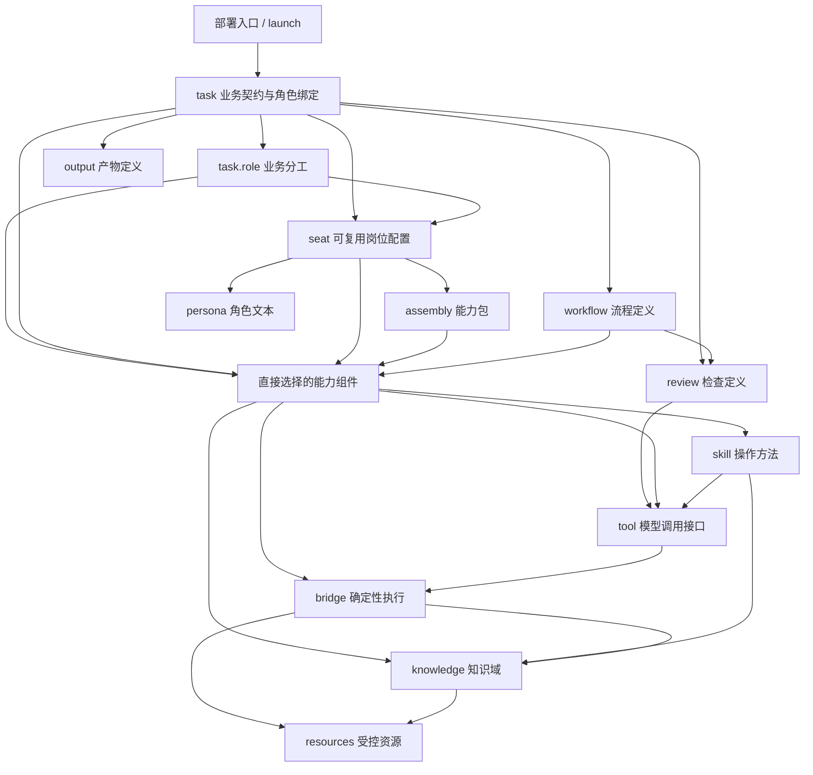
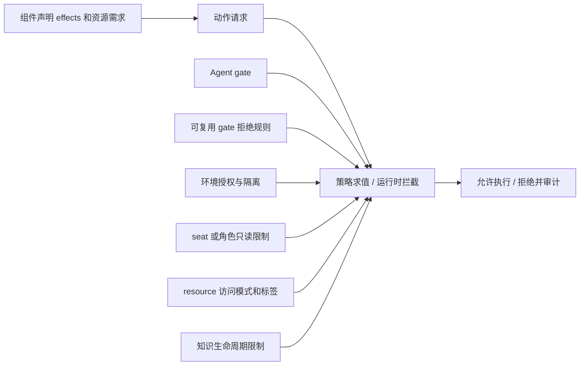

# Loom v0.5 声明依赖、职责边界与约束模型

适用 `agent-dsl/v1alpha2`。本文定义静态契约的依赖规则；运行时隔离、调度、审批和交付仍需适配器实现。图为 Markdown Mermaid，不修改 Draw.io。

## 1. 如何阅读关系图

箭头 A → B 只表示“A 的声明引用或依赖 B”，不表示 B 先运行，也不表示 A 获得 B 的权限。Agent 对所有顶层块的包含关系不是依赖边。

分开维护三种关系：

1. 静态声明依赖：必须是有向无环图，且边类型在白名单内。
2. 运行时控制流：可以有显式、有界的业务回退，不回写静态依赖。
3. 策略约束：在编译和运行时对对象、动作进行检查，不制造被检查对象反向引用策略的依赖。

“禁止跨层级依赖”在本方案中具体指禁止向上、反向和未授权类型的引用；不是禁止所有跨层引用。task 直接引用 workflow、seat 直接引用能力组件，都是明确允许的向下引用。强制每次引用经过所有中间层，会制造无意义包装。

## 2. 静态依赖总图

“直接选择的能力组件”是图上的分类节点，不是新增 DSL 对象。它只包括 skill/tool/bridge/knowledge，不包括 workflow/review/output/persona/gate。

workflow/review/output 仍可存放在 components 容器中，但属于不同语义类别；同在一个数组不代表可任意互相依赖。不新增十种顶层对象，也不允许一个通用 requires 绕过类别约束。

output 的路径和生命周期是资产契约；真实生成、读写和发布由 task 选定的执行能力完成。output 不反向依赖生产它的 task、workflow 或 bridge。

## 3. 各结构只负责什么

| 声明 | 唯一职责 | 不负责 |
|---|---|---|
| metadata | 标识、发布版本、长期目的 | 单次任务状态、授权 |
| identity | Agent 共享身份、职责与人读边界 | 工具注册、流程调度、安全执行 |
| task | 业务目标、输入结果、交互、分工绑定、验收交付 | 重复组件实现、建立运行时实例、授予权限 |
| task role | 此业务中的责任及交接身份 | 自建全局岗位、冒充系统用户或人工批准人 |
| seat | 可跨任务复用的 persona、能力选择和附加限制 | task 目录、流程状态、触发入口、独立沙箱 |
| assembly | 对可执行能力进行静态分组 | 执行顺序、角色绑定、策略作用域 |
| skill | 模型操作方法 | 强制状态、实际授权 |
| tool | 单次调用的输入输出和 bridge action 绑定 | 业务任务契约、任务触发 |
| bridge | 执行确定性查询、计算、验证和受控动作 | 调用上层 task、调度 seat、解除审批 |
| workflow | 业务阶段、角色槽位、交接及人工闸门 | 固定 Agent 级 seat、设置任务目标或权限 |
| review | 检查算法类别、工具及严重度 | 自行挑选任务、隐式扫描所有输出、签发人工批准 |
| output | 受管产物的格式、位置和生命周期 | 执行生产逻辑、代替接收回执 |
| persona | 可复用角色文本 | 能力授予、身份认证 |
| knowledge 组件 | 业务知识域和资产结构 | 连接管理、自动检索服务、全局晋级政策 |
| resources | 资源位置、访问模式、数据标签 | 引用使用者、自动生成工具、表达调度 |
| 顶层 knowledge | 知识组织、候选与正式资产生命周期 | 发放读写权限、自动调用 builder 或 promote |
| 顶层 gate | 全 Agent 动作授权上界和拒绝规则 | 业务角色、任务流程、质量判断 |
| gate 组件 | 可复用附加拒绝规则 | allow 授权、隐式 seat 局部作用域 |
| runtime | 宿主与适配器契约 | 业务目标、隐式发现所有能力 |
| launch | 启动宿主并选择入口 | 定时调度、业务状态机、重复角色绑定 |
| settings | 模型、UI、加载偏好 | 扩大能力范围或权限 |
| memory | 受控的跨会话信息保留 | 正式知识库、原始敏感日志归档 |
| evolution | 待审核的经验改进候选 | 自动修改正式规范、组件和授权 |
| coms | Agent 间受信通信适配 | seat 内部调度、普通消息充当批准 |

## 4. 允许引用与禁止引用

| 来源 | 允许的静态目标 | 明确禁止 |
|---|---|---|
| 入口 | task、runtime；兼容入口另行迁移 | 直接选择 task 内部 phase 绕过准入 |
| task | seat、workflow、review、output、直接能力选择 | 依赖其他 task 形成任务编排网、引用运行实例 |
| task.role | seat 或直接能力选择，二选一 | 引用另一个 task 的局部角色、同时多源合并授权 |
| seat | assembly 或直接能力选择，二选一；可选 persona | task、workflow、review、output、其他 seat |
| assembly | skill/tool/bridge/knowledge | task、seat、其他 group、workflow、gate |
| workflow | 自身局部角色槽位、phase；明确所需能力和检查定义 | Agent seat、task id、launch、反向读取 task 配置 |
| review | 检查工具 | task、seat、生产者；检查目标由上层绑定 |
| skill | tool、knowledge | workflow、task、seat、assembly |
| tool | bridge 及 action | task、seat、workflow、调用其他 tool 绕过绑定 |
| bridge | resource、knowledge | task、seat、workflow、tool |
| knowledge 组件 | resource；Schema/builder 资产位置 | 使用它的 bridge、task 或 seat |
| output/persona | 资产路径或正文 | 使用者或执行者 |
| resource | 无本地声明依赖，只保存定位与访问属性 | 组件、seat、task、gate |

knowledge.builder 指向构建资产位置，不等于运行时依赖一个会回调知识域的 bridge。实际运行 builder 时必须经显式授权的执行能力，不得因路径字段存在而自动执行。

组件能力依赖只登记在 requires；binding、skill.tools、review.checks.tool 等是具体使用位置，必须与 requires 一致，不能偷偷形成另一套依赖图。task、seat、assembly 的结构引用属于组合边，不复制到组件 requires。

同类别组件引用默认禁止；将来确有复用需求时先扩充明确规则与环检测，不允许利用泛型 component 引用绕过白名单。

## 5. task、角色、seat 的唯一绑定

task 独立定义。Agent 的 seats 是岗位配置目录，不维护 seat.tasks 反向列表。

任务执行配置采用以下三种形态，互斥：

1. 单执行上下文、直接能力选择：task.components 显式列出能力，继承 identity，无需 seat。
2. 单执行上下文、岗位复用：task.seat 引用一个岗位，不再重复 components。
3. 多角色任务：task.roles 定义局部角色；每个角色使用 seat 或 components，二选一。角色继承 identity，只能收窄职责与边界。

这些字段与现行 Schema 一致。任务不从 components 容器自动获得全部能力；省略选择必须报错，不得创建全能默认岗位。自由对话且无 tasks 的旧配置继续使用其已声明的入口与能力视图，不作为新任务模式的隐式回退。

workflow 定义局部角色槽位；task 引用它时提供完全匹配的角色绑定。workflow 不反向引用 task.role 对象：它声明自己需要哪些槽位，上层 task 负责满足接口，类似函数参数与调用实参。单执行者流程使用唯一执行者槽位，多角色流程必须显式声明每阶段负责的槽位。人工批准是独立控制节点，不绑定模型岗位冒充人类。

同一 seat 可以被不同任务角色引用；每次运行建立独立的角色执行上下文。配置复用不等于共享会话、状态或凭据。需要实际进程隔离、不同身份或独立审查时，部署必须证明能够满足，否则拒绝启动相应能力。

## 6. 约束组合不是依赖倒挂

这张图是约束输入流，不是静态组件依赖图。资源不需要引用 gate 才能受控，gate 不需要引用 task 才能限制任务。

| 约束种类 | 声明与解释 | 生效及冲突处理 |
|---|---|---|
| 身份与业务承接范围 | identity/persona/role 的自然语言 | 装订上下文；不得宣称已自动证明自然语言一致性 |
| 结构与实例契约 | Schema、task/tool 输入结果 Schema | 静态检查 Schema；运行时检查实例，不符即拒绝 |
| 能力可见性 | task/role → seat/group/组件的闭包 | 链接时检查；角色不能使用其他角色的能力闭包 |
| 所需副作用 | component.effects | 是请求，不是授权；与真实动作不符时拒绝 |
| 资源访问 | resource.access 和数据标签 | 资源边界必须成立；标签不是自动脱敏实现 |
| 授权和禁止 | gate、附加 deny、环境策略 | allow 求交，deny 优先；未知或不可执行的安全要求拒绝 |
| 工作阶段 | workflow 事件、计数上限、checkpoint | 运行时推进；模型文字不构成完成事件或批准 |
| 质量验收 | task 对 review 及 target 的绑定 | 检查具体结果；error 阻断交付，不能授予权限 |
| 生命周期 | knowledge、output 的 candidate/promoted | 名称和路径不等于批准；晋级需独立授权 |
| 结果返回 | task.delivery、受信调用上下文 | 区分执行、验收、送达状态；未收到回执不冒充送达 |

顶层 gate 汇总所有已声明 gate 组件的附加拒绝规则，采用 Agent 全局作用域，不因其位于某个 group 而推断局部作用域；gate 组件不得装入 assembly。若仅某任务需要更小权限，使用明确的能力选择与受支持的执行限制，不偷换全局拒绝规则的作用域。

identity.red_lines.enforced_by 是控制证据索引：校验控制存在，但不创建反向执行依赖，不自动证明文字与控制等价。顶层 knowledge 的规则按资源和产物的明确路径及生命周期检查，不向 bridge 回写配置。

runtime、settings、memory、evolution、coms 作为宿主配置和受限适配器输入，不得反向修改 task/seat/组件定义。evolution 的产物只能成为下一版本的待审候选，不能在当前运行中形成自修改环。

## 7. 真实示例：制度修订

| 声明 | 例子 | 向下引用 |
|---|---|---|
| 入口 | 制度维护后台 | revise-policy task |
| task | 修订制度，交付候选稿 | 流程、起草角色、审查角色、候选产物、验收 |
| 起草角色 | 根据要求编写候选 | policy-writer seat |
| 审查角色 | 检查依据与冲突 | evidence-reviewer seat |
| 起草 seat | 专业起草配置 | 查询组、候选生成组 |
| 审查 seat | 只读证据检查配置 | 查询组、引用检查能力 |
| 查询组 | 可共享能力包 | 查询 skill、查询 tool，依赖闭包含 bridge |
| 查询 tool | 接受关键词，返回带出处事实 | 查询 bridge 的 search action |
| 查询 bridge | 读取制度事实 | 制度知识域、制度存储资源 |
| 知识域 | 报销规则条目结构 | 制度存储资源 |
| 资源 | 制度目录，只读 | 无反向引用 |
| workflow | 起草→审查→必要时退回→人审 | 局部角色槽位，不认识 Agent seat id |
| output | 候选稿格式及路径 | 无生产者反向引用 |
| review | 引用存在性检查 | 检查 tool；由 task 绑定候选产物 |

gate 禁止修改正式目录，只允许受控候选写入；审查角色只读。任务成功不等于正式发布，人工批准也不自动令 Agent 获得原本被禁止的晋级权限。业务退回是 workflow 控制流，不是 task→seat→task 的声明循环。

## 8. 编译检查顺序和拒绝样例

检查顺序：结构 → 名称与 kind → 引用白名单 → 静态依赖环 → 依赖闭包 → 角色槽位绑定 → 能力与策略 → 输入结果及验收目标 → 宿主能力 → 构建。

以下必须分别报告错误，不自动猜测修复：

- seat 引用 task，或组件反向引用 seat：层级违规。
- assembly 包含 workflow、gate 或另一个 group：类别违规。
- 任意静态组件依赖环：输出完整环路径。
- tool 使用的 bridge/action 与 requires 不一致：依赖契约冲突。
- workflow 固定引用某 seat：上下层耦合，要求迁移到角色槽位绑定。
- task 的直接能力、seat 和 roles 同时出现：执行配置歧义。
- workflow 角色缺失、多余或无执行绑定：角色接口不匹配。
- read_only 角色的传递闭包含写 effect：能力边界冲突。
- review 的目标不存在或检查执行者无访问权：验收绑定无效。
- 适配器无法执行声明的隔离、审批或投递要求：能力不支持，不降级成文本承诺。

每个错误包含稳定 code、JSON Pointer、引用路径和修复建议。静态依赖拓扑排序与 workflow 可达性/有界回退是两项独立检查，不能用“禁止循环依赖”误删合法业务迭代。

## 9. 与 v0.4 的迁移边界

历史 v0.4 允许 assembly 装入 workflow 等组件，且 workflow.seat、tool.phase 存在跨层绑定；现行 v1alpha2 已移除这些反向字段，并以类别白名单拒绝错误分组。

迁移必须一起完成：将 assembly 中流程、产物、检查和策略各归其声明入口；将 workflow.seat 改成角色槽位并由 task 绑定；移除 tool.phase 对流程阶段的反向耦合，阶段允许哪些工具改由 workflow 声明；收紧通用 requires 的目标类别；增加 task 的直接能力选择和可选 seat 复用。

旧写法使用 v1alpha1，新写法使用 v1alpha2，通过明确版本入口或显式迁移模式，不在同一模式下悄悄兼容两种解释。旧正例通过旧契约测试，新正例通过新契约测试；禁止为了让旧文件通过而放宽新分层规则。新旧 Schema 独立保存，不只靠文档页眉区分破坏变更。
